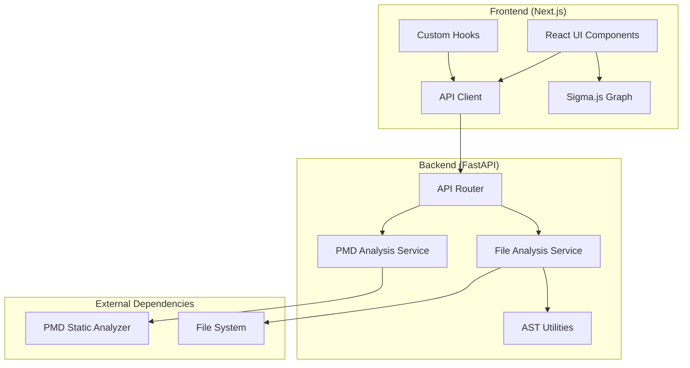

# Design Document

## Overview

The LLM Code Navigator is a full-stack web application designed to analyze and visualize Python codebases. The system follows a microservices architecture with a clear separation between the backend analysis engine and the frontend visualization interface. The application provides real-time code analysis, dependency mapping, interactive visualization capabilities, and static code quality analysis through PMD integration.

**Key Design Rationale**: The microservices architecture enables independent scaling and deployment of analysis and visualization components, while maintaining clear separation of concerns between data processing and user interface responsibilities.

## Architecture

### System Architecture



### Technology Stack

**Backend:**
- FastAPI for REST API framework
- Pydantic for data validation and serialization
- Python AST module for code parsing
- PMD for static code analysis
- Uvicorn as ASGI server

**Frontend:**
- Next.js with React for UI framework
- TypeScript for type safety
- Sigma.js for graph visualization
- Tailwind CSS for styling
- Custom hooks for state management

**Infrastructure:**
- Docker containers for both services
- Docker Compose for orchestration
- Volume mounting for code analysis

## Components and Interfaces

### Backend Components

#### 1. API Router (`app/api/router.py`)
- **Purpose**: Dynamic endpoint discovery and routing
- **Functionality**: Automatically discovers and includes all endpoint modules
- **Pattern**: Convention-over-configuration approach

#### 2. File Analysis Service (`app/services/file_service.py`)
- **Purpose**: Core file system analysis and dependency extraction
- **Key Methods**:
  - `get_file_data()`: Main entry point returning complete file analysis
  - `get_files_info()`: Scans directory for Python files
  - `get_file_info()`: Analyzes individual file dependencies
  - `get_file_content()`: Secure file content retrieval

#### 3. PMD Analysis Service (`app/services/pmd_service.py`)
- **Purpose**: Static code analysis using PMD tool for code quality assessment
- **Key Methods**:
  - `run_pmd_analysis()`: Executes PMD with Java quickstart ruleset for comprehensive code quality checks
- **Output**: JSON-formatted analysis results containing code quality metrics and violations
- **Error Handling**: Provides meaningful error messages for PMD command failures
- **Design Rationale**: PMD integration provides standardized code quality analysis without requiring custom rule implementation

#### 4. AST Utilities (`app/utils/ast_utils.py`)
- **Purpose**: Python Abstract Syntax Tree parsing
- **Key Methods**:
  - `extract_imports()`: Parses import statements from Python code
- **Error Handling**: Graceful handling of syntax errors

### Frontend Components

#### 1. Layout Component (`components/layout/Layout.tsx`)
- **Purpose**: Main application layout and component orchestration
- **Props**: FileSystem data, content fetcher functions

#### 2. File Graph Component (`components/FileGraph/FileGraph.tsx`)
- **Purpose**: Interactive graph visualization using Sigma.js for code structure exploration
- **Features**: 
  - Node-based file representation with click interaction
  - Edge-based dependency visualization showing import relationships
  - Zoom and pan capabilities for large codebases
  - Node selection triggers file content display
- **Design Rationale**: Sigma.js provides performant graph rendering for large codebases while maintaining smooth user interactions

#### 3. File List Component (`components/FileGraph/FileList.tsx`)
- **Purpose**: Hierarchical file browser interface for direct file navigation
- **Features**:
  - Tree-view file navigation
  - File type icons for visual identification
  - Click-to-select functionality for file content viewing
- **Design Rationale**: Provides familiar file explorer interface as alternative to graph navigation for users preferring traditional file browsing

#### 4. Custom Hooks (`hooks/useFileSystem.ts`)
- **Purpose**: Centralized state management for file system data and operations
- **Features**:
  - Async data fetching for file analysis and content
  - Comprehensive error handling with user-friendly messages
  - Loading states for better user experience
  - PMD analysis result management
- **Design Rationale**: Custom hooks encapsulate complex state logic and provide reusable data fetching patterns across components

### API Interfaces

#### File Endpoints (`/api/files/`)
```typescript
GET /files_info -> FileData
  // Returns complete file structure with nodes and relationships
  // Includes security validation for configured directory access

GET /file_content/{full_path:path} -> FileContent
  // Retrieves file content with proper encoding handling
  // Validates file paths to prevent directory traversal attacks
```

#### PMD Endpoints (`/api/pmd/`)
```typescript
GET /analysis/{full_path:path} -> PmdResult
  // Executes PMD static analysis with Java quickstart ruleset
  // Returns JSON-formatted code quality metrics and violations
  // Provides meaningful error messages for analysis failures
```

**Design Rationale**: RESTful API design with clear resource separation enables independent frontend development and potential future API consumers.

## Data Models

### Core Data Structures

```typescript
interface FileNode {
  id: string
  name: string
  type: 'file' | 'directory'
  children?: FileNode[]
}

interface FileEdge {
  source: string
  target: string
}

interface FileData {
  files: FileNode[]
  relationships: FileEdge[]
}

interface FileContent {
  content: string
  path: string
  encoding: string
}

interface PmdResult {
  violations: PmdViolation[]
  summary: {
    totalViolations: number
    fileAnalyzed: string
  }
}

interface PmdViolation {
  rule: string
  priority: number
  message: string
  line: number
  column: number
}
```

**Design Rationale**: Structured data models ensure type safety and consistent data flow between backend analysis and frontend visualization components.

### Backend Models (Pydantic)

```python
class FileNode(BaseModel):
    id: str
    name: str
    type: str
    children: Optional[List['FileNode']] = None

class FileEdge(BaseModel):
    source: str
    target: str

class FileData(BaseModel):
    files: List[FileNode]
    relationships: List[FileEdge]

class FileContent(BaseModel):
    content: str
    path: str
    encoding: str = "utf-8"

class PmdViolation(BaseModel):
    rule: str
    priority: int
    message: str
    line: int
    column: int

class PmdResult(BaseModel):
    violations: List[PmdViolation]
    summary: dict
```

**Design Rationale**: Pydantic models provide automatic data validation, serialization, and documentation generation while ensuring data integrity across the API boundary.

## Error Handling

### Backend Error Strategy

1. **Input Validation**: Pydantic models ensure data integrity and type safety
2. **Path Security**: Absolute path validation prevents directory traversal attacks (Requirement 5.2)
3. **File System Errors**: Specific handling for FileNotFoundError, PermissionError with appropriate error messages (Requirement 1.5, 3.4)
4. **External Tool Errors**: PMD command execution error handling with meaningful error messages (Requirement 4.5)
5. **Logging**: Comprehensive logging for debugging and monitoring purposes (Requirement 5.3)
6. **Concurrent Request Handling**: Efficient processing of multiple simultaneous requests (Requirement 5.4)

**Design Rationale**: Layered error handling approach ensures system resilience while providing clear feedback to users and developers for debugging purposes.

### Frontend Error Strategy

1. **API Error Handling**: Try-catch blocks with user-friendly messages for file and PMD analysis failures (Requirement 3.4, 4.4)
2. **Loading States**: Clear indication of data fetching status during file analysis and content retrieval
3. **Fallback UI**: Graceful degradation when data is unavailable or analysis fails
4. **Error Boundaries**: React error boundaries for component-level errors
5. **File Content Display**: Proper error handling for file not found scenarios (Requirement 3.4)
6. **Graph Interaction**: Error handling for node selection and content loading failures

**Design Rationale**: Progressive error handling ensures users receive clear feedback while maintaining application stability during various failure scenarios.

### HTTP Status Codes

- `200`: Successful operation
- `403`: Access denied (path security violation)
- `404`: File not found
- `500`: Internal server error (PMD failures, unexpected errors)

## Testing Strategy

### Backend Testing

1. **Unit Tests**: Individual service method testing
2. **Integration Tests**: API endpoint testing with test data
3. **Security Tests**: Path traversal and access control validation
4. **Mock Testing**: External dependency mocking (PMD, file system)

### Frontend Testing

1. **Component Tests**: React component rendering and interaction
2. **Hook Tests**: Custom hook behavior and state management
3. **API Integration Tests**: Mock API responses and error scenarios
4. **Visual Tests**: Graph rendering and interaction testing

### Test Structure

```
backend/tests/
├── test_file_service.py
├── test_pmd_service.py
└── test_api_endpoints.py

frontend/src/components/FileGraph/
├── FileContent.test.tsx
├── FileList.test.tsx
└── PmdResult.test.tsx
```

## Security Considerations

### Path Security
- All file paths validated against configured base directory to prevent unauthorized access (Requirement 5.2)
- Absolute path resolution prevents directory traversal attacks (Requirement 1.4, 3.2)
- CORS middleware controls cross-origin requests (Requirement 5.1)
- File access restricted to configured backend directory only (Requirement 1.1)

**Design Rationale**: Multi-layered security approach ensures the system cannot be exploited to access files outside the intended analysis scope, protecting sensitive system files and user data.

### Data Validation
- Pydantic models ensure type safety and data integrity for all API responses (Requirement 1.3)
- Input sanitization for all API endpoints with proper validation
- Secure file content reading with encoding handling (Requirement 3.5)
- Structured data models for file nodes, relationships, and PMD results (Requirement 4.3)

**Design Rationale**: Comprehensive data validation prevents malformed data from propagating through the system and ensures consistent API behavior across all endpoints.

### Configuration Management
- Environment-based configuration using Pydantic Settings
- Secure defaults for all configuration values
- Docker volume mounting for controlled file access

## Static Code Analysis Integration

### PMD Analysis Workflow
1. **Analysis Trigger**: User selects file for quality analysis through UI interaction
2. **Command Execution**: PMD service executes Java quickstart ruleset on target file (Requirement 4.1, 4.2)
3. **Result Processing**: JSON output parsed and structured into violation objects
4. **UI Display**: Results presented in user-friendly format with violation details (Requirement 4.4)

### PMD Integration Design Decisions
- **Ruleset Selection**: Java quickstart ruleset chosen for comprehensive code quality coverage without overwhelming users
- **Output Format**: JSON format enables structured data processing and flexible UI presentation
- **Error Handling**: Graceful degradation when PMD analysis fails, with clear error messaging (Requirement 4.5)
- **Performance**: On-demand analysis prevents unnecessary processing overhead

**Design Rationale**: PMD integration provides industry-standard code quality analysis without requiring custom rule development, while maintaining system performance through selective analysis execution.

## Performance Considerations

### Backend Optimization
- Efficient file system traversal using os.walk for Python file discovery (Requirement 1.1)
- Lazy loading of file content (on-demand) to reduce memory usage (Requirement 3.1)
- Caching opportunities for repeated analysis requests
- Concurrent request handling for multiple user sessions (Requirement 5.4)

### Frontend Optimization
- React component memoization for large file trees
- Sigma.js optimization for large graph rendering with zoom/pan capabilities (Requirement 2.4)
- Debounced user interactions for better UX during file selection
- Efficient state management through custom hooks (Requirement 2.3)

### Scalability
- Stateless API design enables horizontal scaling
- Docker containerization supports deployment flexibility
- Modular architecture allows independent component scaling
- Separation of file analysis and PMD services enables independent scaling based on usage patterns

**Design Rationale**: Performance optimizations focus on user experience during interactive exploration of large codebases while maintaining system responsiveness under concurrent usage.